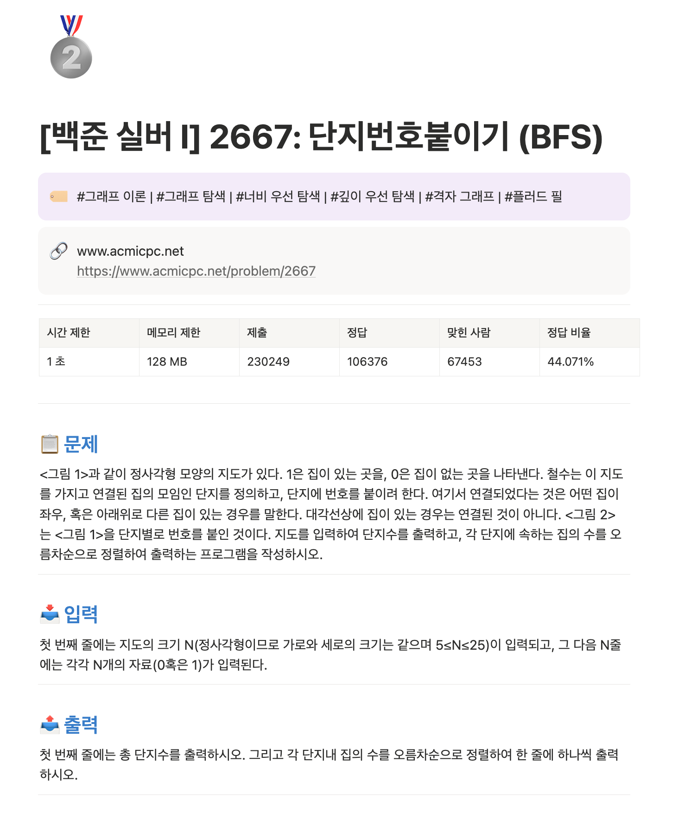

# 백준 문제 Notion 자동 정리 도구

백준 온라인 저지 문제를 크롤링하여 Notion에 자동으로 정리해주는 CLI 도구입니다.

## 📸 예시



## 🎯 주요 기능

- 백준 문제 URL 입력 시 자동 크롤링
- solved.ac API를 통한 난이도(티어) 및 알고리즘 태그 가져오기
- 티어별 아이콘 (🥉🥈🥇💎💠) 자동 적용
- 중복 문제 체크
- Notion 페이지 자동 생성

---

## 🔄 동작 원리

```
┌─────────────┐     ┌──────────────┐     ┌─────────────┐     ┌─────────────┐
│  사용자     │ ──▶ │  main.py     │ ──▶ │ scraper.py  │ ──▶ │ 백준 서버   │
│  (CLI 입력) │     │  (진입점)    │     │ (크롤링)    │     │ (HTML)      │
└─────────────┘     └──────────────┘     └─────────────┘     └─────────────┘
                           │                    │
                           │                    ▼
                           │              ┌─────────────┐
                           │              │ solved.ac   │
                           │              │ API (티어)  │
                           │              └─────────────┘
                           │                    │
                           ▼                    ▼
                    ┌──────────────┐     ┌─────────────┐
                    │ notion_api   │ ◀── │ 문제 데이터 │
                    │ (페이지 생성)│     │ (dict)      │
                    └──────────────┘     └─────────────┘
                           │
                           ▼
                    ┌──────────────┐
                    │ Notion 페이지 │
                    │ 생성 완료!   │
                    └──────────────┘
```

### 상세 동작 과정

1. **CLI 입력** (`main.py`)
   - 사용자가 백준 문제 URL 입력
   - 환경 변수 검증 및 URL 유효성 검사

2. **웹 크롤링** (`scraper.py`)
   - requests로 백준 페이지 HTML 가져오기
   - BeautifulSoup으로 파싱하여 데이터 추출:
     - 제목, 시간/메모리 제한, 정답 비율
     - 문제 설명, 입력, 출력, 예제
   - solved.ac API로 티어 및 알고리즘 태그 조회

3. **Notion 페이지 생성** (`notion_api.py`)
   - 중복 문제 체크 (이미 등록된 문제면 스킵)
   - 티어별 아이콘 및 색상 결정
   - Notion API로 페이지 생성 (블록 구조화)

---

## 📁 프로젝트 구조

```
baekjoon-notion/
├── main.py           # CLI 진입점
├── scraper.py        # 백준 크롤링 모듈
├── notion_api.py     # Notion API 연동
├── config.py         # 환경 변수 관리
├── requirements.txt  # 의존성 목록
├── .env              # API 키 (Git 제외)
├── .env.example      # 환경 변수 예시
└── README.md         # 문서
```

### 각 파일 설명

| 파일 | 역할 |
|------|------|
| `main.py` | CLI 인터페이스, argparse로 인자 처리 |
| `scraper.py` | BeautifulSoup으로 HTML 파싱 |
| `notion_api.py` | Notion SDK로 페이지/블록 생성, 중복 체크 |
| `config.py` | python-dotenv로 .env 파일 로드 |

---

## 🚀 설치 및 실행

### 1. 의존성 설치

```bash
cd /Users/choihanjun/Desktop/CodingTest/baekjoon-notion
python3 -m venv venv
source venv/bin/activate
pip install -r requirements.txt
```

### 2. Notion Integration 설정

1. [Notion Developers](https://www.notion.so/my-integrations) 접속
2. **New integration** 클릭 → 이름 입력 → 생성
3. **Internal Integration Token** 복사

### 3. Notion 페이지 연결

1. Notion에서 문제를 저장할 페이지 생성
2. 페이지에서 `...` → **Connections** → 생성한 Integration 연결
3. 페이지 URL에서 ID 복사:
   ```
   https://notion.so/workspace/abc123def456...
                              ^^^^^^^^^^^^^^^^ 이 부분
   ```

### 4. 환경 변수 설정

```bash
cp .env.example .env
# .env 파일 편집
```

```
NOTION_TOKEN=secret_xxxxxxxx
NOTION_PARENT_PAGE_ID=abc123def456...
```

### 5. 실행

```bash
source venv/bin/activate
python main.py https://www.acmicpc.net/problem/1000
```

---

## 📖 사용법

### 기본 사용
```bash
python main.py https://www.acmicpc.net/problem/14716
```

### Notion 연결 테스트
```bash
python main.py --test
```

### 출력 예시
```
🔍 문제 크롤링 중: https://www.acmicpc.net/problem/3190
   ✓ 문제: 뱀
   ✓ 난이도: Gold IV
   ✓ 태그: 구현, 자료 구조, 시뮬레이션, 덱, 큐
📝 Notion 페이지 생성 중...

==================================================
✅ 완료!
📄 Notion 페이지: https://www.notion.so/...
==================================================
```

---

## 🎨 생성되는 Notion 페이지 구조

```
🥇 [백준 골드 IV] 3190: 뱀

├── 🏷️ 알고리즘 태그 (구현 | 시뮬레이션 | ...)
├── 🔗 문제 링크
├── 📊 문제 정보 테이블 (시간/메모리/정답률)
├── ───────────────
├── 📋 문제 (텍스트 + 이미지)
├── ───────────────
├── 📥 입력
├── ───────────────
├── 📤 출력
├── ───────────────
├── 💻 예제
│   ├── 예제 입력 1 (코드 블록)
│   └── 예제 출력 1 (코드 블록)
├── ───────────────
└── ✏️ 풀이 (작성 공간)
```

---

## ⚙️ 티어별 아이콘

| 티어 | 아이콘 |
|------|--------|
| Bronze | 🥉 |
| Silver | 🥈 |
| Gold | 🥇 |
| Platinum | 💎 |
| Diamond | 💠 |
| Ruby | 💎 |

---

## 🔧 문제 해결

| 오류 | 해결 방법 |
|------|----------|
| `NOTION_TOKEN이 설정되지 않았습니다` | `.env` 파일 확인 |
| `Could not find database with ID` | Integration이 페이지에 연결되었는지 확인 |
| `이미 등록된 문제입니다` | 정상 동작 - 중복 방지 기능 |

---

## 📚 사용된 기술

- **Python 3**: 메인 언어
- **requests**: HTTP 요청
- **BeautifulSoup4**: HTML 파싱
- **notion-client**: Notion API SDK
- **python-dotenv**: 환경 변수 관리
